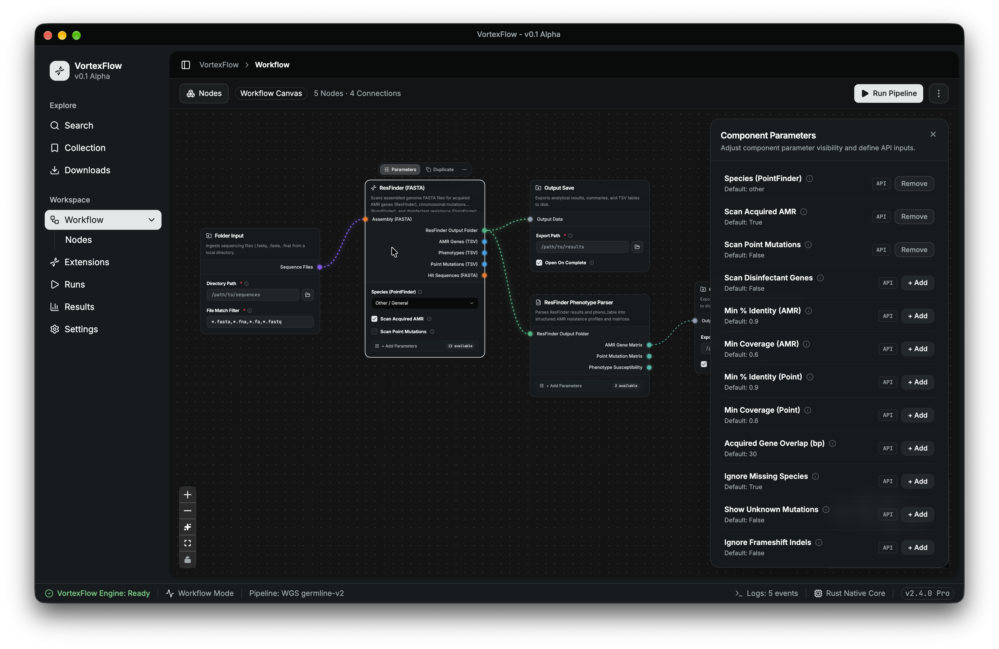
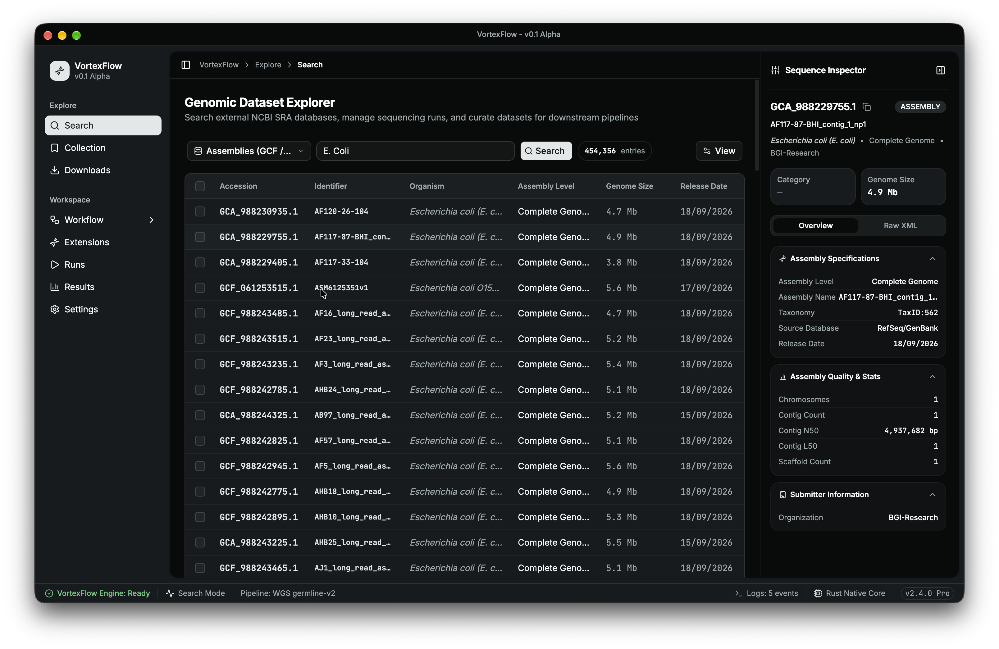
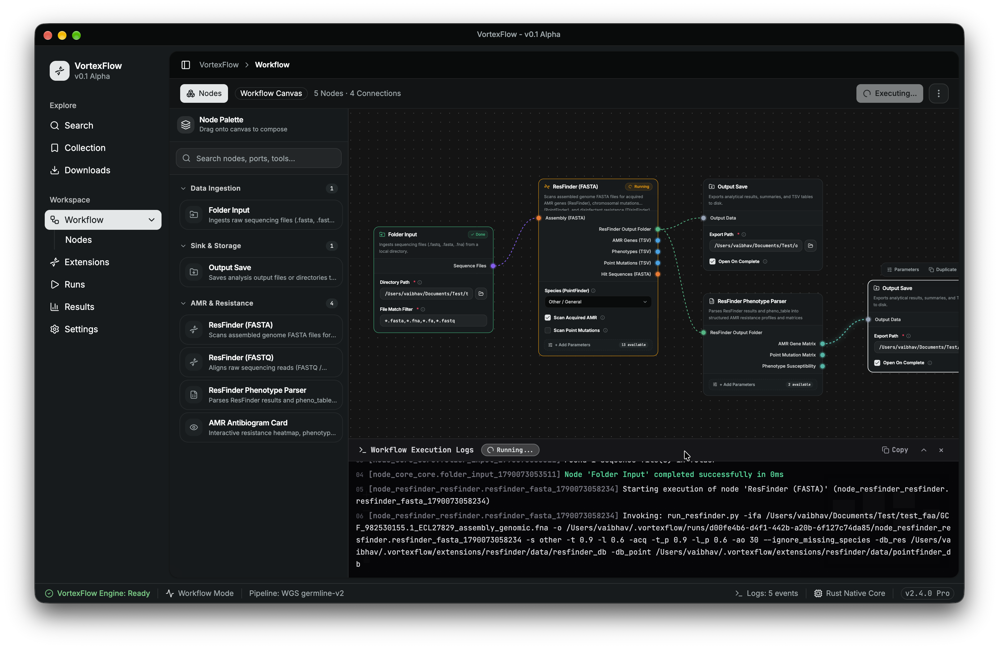
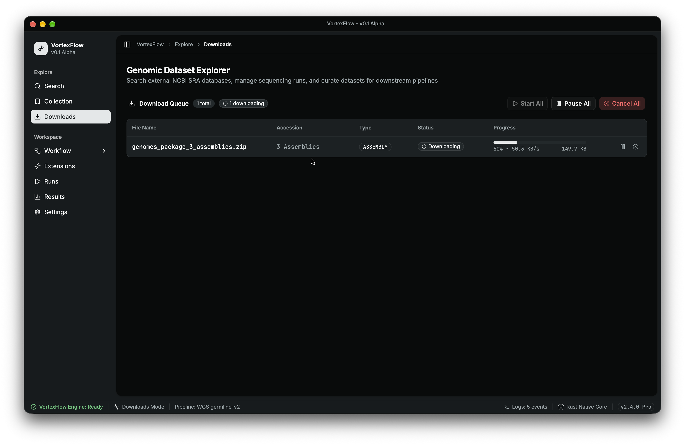

# VortexFlow

A modern, visual, node-based pipeline builder and analysis workbench for bacterial genomics and bioinformatics workflows.

VortexFlow pairs a high-performance **Rust** core engine with a responsive, modern **React / Electron** desktop workspace. It allows bioinformaticians and researchers to compose Directed Acyclic Graph (DAG) pipelines, ingest genomic datasets directly from NCBI Entrez, configure tool parameters interactively, and execute reproducible workflows with automated Conda/Rattler environment isolation and real-time streaming feedback.

## Screenshots

| Pipeline Canvas | NCBI Search |
|:-:|:-:|
|  |  |

| Running a Workflow | Downloader |
|:-:|:-:|
|  |  |

## Key Features

- **Interactive Node-Based Pipeline Canvas**
  - Graph-based workflow builder powered by `@xyflow/react` and custom nodes.
  - Automatic topological DAG organization using Dagre graph layout (`LR` orientation).
  - Strict socket type compatibility validation preventing invalid connections between tools.
  - Immediate cycle detection via `petgraph` ensuring valid DAG execution.
  - Full pipeline export/import in `.vortexflow` format.

- **Component Parameters & Dynamic Inspections**
  - Contextual parameters panel with smooth slide-in / slide-out transitions.
  - Intuitive dismissal on clicking off-screen or pressing `Escape`.
  - Node-level parameter visibility controls and default value management.
  - Floating action toolbars on nodes for duplication, parameter inspection, and debugging.

- **NCBI Entrez Genomic Data Explorer**
  - Query and explore NCBI databases (SRA, BioProject, Assembly, Taxonomy) directly within the app.
  - Inspect sample attributes, sequencing platform specs, and contig quality metrics (N50, L50, GC content).
  - Formatted XML inspector with syntax highlighting and instant accession copying.

- **Resilient Multi-Part Downloader Engine**
  - Decoupled parallel chunked HTTP downloader engine (`vortexflow-downloader`).
  - Dynamic concurrency, automatic retries with exponential backoff, and pause/resume lifecycle support.
  - Direct integration with local dataset collections and bookmarks.

- **Isolated Execution Engine & Real-Time Telemetry**
  - Process execution core (`vortexflow-engine`) with Rattler / Conda environment provisioning.
  - Real-time Server-Sent Events (SSE) streaming for live `stdout` and `stderr` logs.
  - Execution console drawer with expandable terminal view, log copy, and execution reports.
  - Interactive analysis visualizers (antibiogram resistance matrices, QC charts via Recharts).

## Workspace Architecture

VortexFlow is organized as a Cargo workspace combining native applications and modular crates alongside an Electron/React client.

```
ngs-toolkit/
├── apps/
│   ├── cli/             # vortexflow-cli: Command-line interface for headless execution
│   ├── gui/             # vortexflow-gui: Desktop application (Electron + React + Tailwind CSS)
│   └── server/          # vortexflow-server: Local Axum HTTP & SSE API backend
├── crates/
│   ├── db/              # vortexflow-db: SQLite embedded database persistence (rusqlite)
│   ├── downloader/      # vortexflow-downloader: Parallel chunked HTTP download engine
│   ├── engine/          # vortexflow-engine: Execution engine & Rattler environment management
│   ├── identity/        # vortexflow-identity: Authentication and session management
│   ├── logging/         # vortexflow-logging: Tracing subscribers & SSE broadcast channels
│   ├── providers/       # vortexflow-providers: NCBI Entrez E-Utilities integration client
│   ├── resolve/         # vortexflow-resolve: Package & environment resolution
│   ├── storage/         # vortexflow-storage: Artifact and file management
│   ├── types/           # vortexflow-types: Shared primitives and data contracts
│   └── workflow/        # vortexflow-workflow: DAG graph models, topological validator & schemas
├── docs/                # Architecture docs & manifest schemas
└── manifests/           # Tool definitions and manifests (FastQC, ResFinder, etc.)
```

### Application Components

| Member | Path | Description |
| - | - | - |
| `vortexflow-gui` | `apps/gui` | Electron + React 19 desktop GUI using Tailwind CSS v4, Base UI, Shadcn, and `@xyflow/react`. |
| `vortexflow-server` | `apps/server` | High-performance Axum REST and SSE backend orchestrating pipelines, downloads, and queries. |
| `vortexflow-cli` | `apps/cli` | Headless CLI for running `.vortexflow` pipelines in automated clusters or scripts. |

### Core Crates

| Crate | Description |
| - | - |
| `vortexflow-workflow` | DAG structure, cycle detection, port matching, and manifest definitions. |
| `vortexflow-engine` | Subprocess execution, environment provisioning, and node runner lifecycle. |
| `vortexflow-downloader` | Concurrent chunked HTTP downloads with retry and pause/resume logic. |
| `vortexflow-providers` | NCBI Entrez (ESearch, ESummary, EFetch) genomic metadata retrieval. |
| `vortexflow-db` | SQLite persistence for downloaded records, search histories, and pipeline runs. |
| `vortexflow-logging` | Structured tracing and real-time SSE event log distribution. |
| `vortexflow-storage` | Local file management, sequence folders, and artifact saving. |
| `vortexflow-types` | Shared genomic types, socket types, and status enumerations. |
| `vortexflow-resolve` | Tool dependency resolution and environment configurations. |
| `vortexflow-identity` | User identity and authentication primitives. |

## Tech Stack

- **Backend & Core Engine**: Rust 2024 edition, Axum, Tokio, Petgraph, Rusqlite, Tracing, Reqwest
- **Frontend & Desktop App**: Electron, React 19, TypeScript, Vite, Tailwind CSS v4, `@xyflow/react`
- **UI Components & Styling**: `@base-ui/react`, Shadcn UI primitives, Lucide Icons, Recharts, Prism React Renderer
- **Bioinformatics Environments**: Conda / Rattler package resolution, tool manifest specifications

## Getting Started

### Prerequisites

- **Rust**: Latest stable version (Rust 2024 edition support required)
  ```bash
  curl --proto '=https' --tlsv1.2 -sSf https://sh.rustup.rs | sh
  ```
- **Node.js & npm**: Node.js v20+ recommended
- **Cargo**: Installed with Rust

### Installation

Clone the repository and install frontend dependencies:

```bash
git clone https://github.com/vaibhavvikas/vortex-flow.git
cd vortex-flow

# Install GUI dependencies
cd apps/gui
npm install
cd ../..
```

### Running in Development

#### Option 1: Full Desktop App (Electron + Server)

Run the backend server and frontend inside Electron concurrently:

```bash
cd apps/gui
npm run electron:dev
```

#### Option 2: Browser GUI + Backend Server

Run the backend server in one terminal:

```bash
cargo run -p vortexflow-server
# Server listens on http://127.0.0.1:8080
```

Run the Vite development server in another terminal:

```bash
cd apps/gui
npm run dev
# Vite runs on http://localhost:1420
```

## Building & Testing

### Rust Workspace Tests

Validate all crates and workspace members:

```bash
# Check compilation
cargo check

# Run unit and integration tests
cargo test
```

### Frontend Build & Linting

Verify TypeScript types and build the frontend bundle:

```bash
cd apps/gui

# Typecheck
npm run typecheck

# Lint
npm run lint

# Production build
npm run build
```

## Tool Manifests & Extensions

VortexFlow uses declarative JSON manifests in `manifests/` to integrate bioinformatics tools without modifying core code. Each manifest defines:

- Metadata (name, category, version, description)
- Execution environments (Conda dependencies, container specs)
- Input and output sockets with validated types (`sequence_files`, `tsv_report`, `json_artifact`, etc.)
- CLI parameter flags, default values, and visibility controls

For more details on defining custom tools, consult [docs/manifest-schema.md](docs/manifest-schema.md).

## License

This project is licensed under the [MIT License](LICENSE).